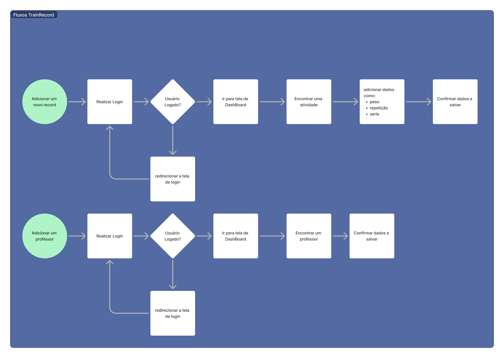
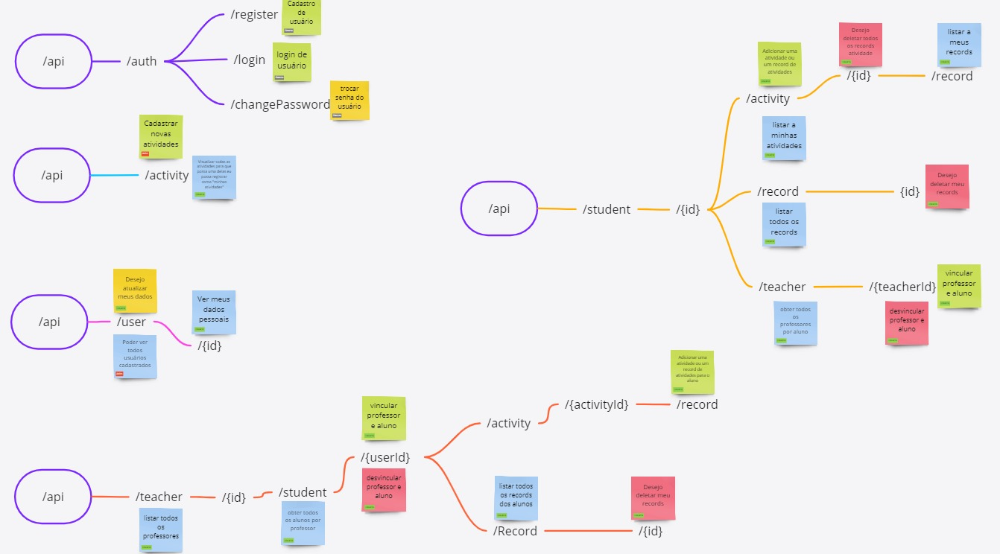
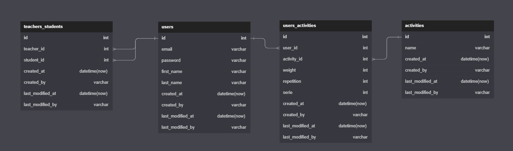

<p align="center">

</p>

<h1 align="center">TrainRecord🏋️‍♀️</h1>

<br/>
TrainRecord é uma aplicação desenvolvida em .NET C# com a finalidade de gerenciar atividades de academia para alunos e monitoramento para os professores.

Temos 3 tipos de users:
- Adm (usuário dono do app)
- Aluno (usuário que cadastra as atividades realizadas e sua evolução nelas)
- Professor (usuário que apenas acompanha o desenvolvimento de seus alunos)

## Índice 🗂️

- [Tecnologias 💻](#tecnologias-💻)
  - [Tools](#tools)
  - [Pacotes](#pacotes)
  - [Prettier](#prettier)
  - [Husky](#husky)
- [Rodando a aplicação ⚙️](#rodando-a-aplicação-⚙️)
- [Arquitetura 🏛️](#arquitetura-🏛️)
  - [Pastas](#pastas)
- [Documentação API 💼](#documentação-api-💼)
  - [Diagramas](#diagramas)
  - [Rotas de Autenticação](#rotas-autenticação)
    - [Criar conta](#criar-conta)
    - [Login conta](#login-conta)
    - [Trocar Senha](#trocar-senha)
  - [Rotas de Usuário](#rotas-usuário)
    - [Atualizar dados do usuário](#atualizar-dados-do-usuário)
    - [Listar todas os usuários](#listar-todas-os-usuários)
    - [Obter dados de usuário por id](#obter-dados-de-usuário-por-id)
  - [Rotas de Atividade](#rotas-atividade)
    - [Adicionar uma nova atividade](#adicionar-uma-nova-atividade)
    - [Listar todas as atividade](#listar-todas-as-atividade)
  - [Rotas de Record](#rotas-record)
    - [Adicionar record de atividade](#adicionar-record-de-atividade)
    - [Listar todos os records de uma atividade do aluno](#listar-todos-os-records-de-uma-atividade-do-aluno)
    - [Deletar Record por id](#deletar-record-por-id)
    - [Deletar Record por atividade do aluno](#deletar-record-por-atividade-do-aluno)
  - [Rotas de Professor](#rotas-de-professor)
    - [Vincular professor no aluno](#vincular-professor-no-aluno)
    - [Listar todas os Professores](#listar-todas-os-professores)
    - [Listar todas os Alunos por professor](#listar-todas-os-alunos-por-professor)
    - [Remover aluno por professor](#remover-aluno-por-professor)
  - [Rotas de Aluno](#rotas-de-professor)
    - [Listar todas os professores do aluno](#listar-todas-os-professores-do-aluno)
    - [Vincular aluno no professor](#vincular-aluno-no-professor)
    - [Remover professor por aluno](#remover-professor-por-aluno)
    - [Listar todas as atividades do aluno](#listar-todas-as-atividades-do-aluno)

- [Release 📦](#release-📦)
- [Autores 🧑‍🤝‍🧑](#autores-🧑‍🤝‍🧑)
- [License 🪪](#license-🪪)
- [Star ⭐](#star-⭐)

# Tecnologias 💻

- AspNet.Core SDK 7.0.100-rc.2.22477.23

## Pacotes

- [Mediatr](https://github.com/jbogard/MediatR): para gerenciar comandos e queries no padrão CQRS.
- [FluentValidation](https://docs.fluentvalidation.net/en/latest/): para validação dos campos de request.
- [Mapster](https://github.com/MapsterMapper/Mapster): para mapeamento dos objetos com Adapt<>().
- [ErrorOr](https://github.com/amantinband/error-or): para retorno de api com erro ou o response.
- [Jwt](https://jwt.io/): para autenticação do usuário.
- [PasswordHasher](<https://github.com/BcryptNet/bcrypt.net>): hasher de senha do usuário com bcrypt.net.
- [Sqlite](https://www.sqlite.org/docs.html): apenas como banco de dados de desenvolvimento.
- [Xunit](https://xunit.net): projeto de testes de unidade.
- [Moq](https://github.com/moq): mocar dependencias para testes.
- [Testcontainers](https://dotnet.testcontainers.org/): gerar conteiners de banco de dados para testes de integração.

## Tools

- csharpier.
- husky.

para a instalação dos tools deste projeto, basta executar o build do projeto TrainRecord.Api.csproj com o seguinte comando em seu terminal

```
dotnet build
```

## Prettier

Como formatador de C# está sendo utilizado o [csharpier](https://csharpier.com) e suas configurações estão no arquivo .csharpierrc.json localizado na raiz deste projeto.

## Husky

As mensagens de commits deste repo seguem o seguinte regex
`^(feat|fix|ci|chore|docs|test|style|refactor|perf|build|revert)(\(.+?\))?: .{1,}$`.

No pré-commit executamos o comando `dotnet csharpier .` para formatar antes do commit.

# Rodando a aplicação ⚙️

## Via Localmente

Simplesmente em seu terminal.

```sh
git clone https://github.com/GustavoM96/TrainRecord.git
dotnet build
dotnet run --project src/TrainRecord.Api
```

## Via Docker

Simplesmente em seu terminal.

```sh
git clone https://github.com/GustavoM96/TrainRecord.git
docker compose up
```

# Arquitetura 🏛️

## Pastas

### Docs

- release: contém dados de cada release.
- todo: contendo os requesitos de desenvolvimento.

### Src


- Api - Camada de configuração de api, direcionar os dados de request e response para o usuário.

- Application - Camada responsável por criar os comandos e queries que conecta a api com a Infrastructure no padrão CQRS.

- Core - Camada de entidades, enums, exceptions e regras de negócio.

- Infrastructure - Camada que obtem dados externos como api, banco de dados, filas e outros.

### Assets

- contém imagens utilizadas.

# Documentação API 💼

## Diagramas

- Fluxos do usuário

    

- Mapeamento das rotas

    

- Entidades de Banco de dados

    

<hr/>

## Rotas Autenticação

### Criar conta

- Autenticação: Anônimo.
- Detalhes: registrar usuário dentro da plataforma.

#### Request

```
Post /api/auth/register
```

```json
{
  "email": "josé.silva@gmail.com",
  "password": "sd#fd$904&3jkdf",
  "firstName": "José",
  "lastName": "Silva",
  "Role": 1
}
```

#### Response 201 Created

```json
{
  "id": "00000000-0000-0000-0000-000000000000",
  "email": "josé.silva@gmail.com",
  "firstName": "José",
  "lastName": "Silva",
  "Role": 1
}
```

### Login conta

- Autenticação: Anônimo.
- Detalhes: autenticação do usuário.

#### Request

```
Post /api/auth/login
```

```json
{
  "email": "josé.silva@gmail.com",
  "password": "sd#fd$904&3jkdf"
}
```

#### Response 200 Ok

```json
{ "idToken": "fs432jnj543hb-lsdsdasdsadasd-df4545" }
```

### Trocar Senha

- Autenticação: Dono do Recurso.
- Detalhes: Trocar Senha.

#### Request

```
Post /api/auth/changePassword
```

```json
{
  "email": "josé.silva@gmail.com",
  "password": "sd#fd$904&3jkdf",
  "newPassword": "sd#fd$904&3jkdf#NovaSenha"
}
```

#### Response 204 NoContent

```json
Sem corpo de resposta
```

## Rotas Usuário

### Listar todas os Usuários

- Autenticação: Apenas Adm.
- Detalhes: Obter todos os usuários cadastrados na plataforma.

```
Get /api/user
```

#### Request

```json
sem corpo de requisição
```

#### Response 200 Ok

```json
{
  "items": [
    {
      "id": "00000000-0000-0000-0000-000000000000",
      "email": "josé.silva@gmail.com",
      "firstName": "José",
      "lastName": "Silva"
    },
    {
      "id": "00000000-0000-0000-0000-000000000001",
      "email": "caio.costa@gmail.com",
      "firstName": "Caio",
      "lastName": "Costa"
    }
  ],
  "perPage": 2,
  "pageNumber": 4
}
```

### Atualizar dados do usuário

- Autenticação: Dono do recurso.
- Detalhes: Atualizar dados dos usuário.

```
Patch /api/user/{userId}
```

#### Request

```json
{ "firstName": "José#NomeTrocado" }
```

#### Response 200 Ok

```json
{
  "id": "00000000-0000-0000-0000-000000000000",
  "email": "josé.silva@gmail.com",
  "firstName": "José#NomeTrocado",
  "lastName": "Silva"
}
```

### Obter dados de usuário por id

- Autenticação: Apenas o dono do recurso.
- Detalhes: Obter dados de usuário por id.

```
Get /api/user/{idUser}
```

#### Request

```json
sem corpo de requisição
```

#### Response 200 Ok

```json
{
    {
      "id": "00000000-0000-0000-0000-000000000000",
      "email": "josé.silva@gmail.com",
      "firstName": "José",
      "lastName": "Silva"
    }
}
```

## Rotas Atividade

### Adicionar uma nova atividade

- Autenticação: Apenas Adm.
- Detalhes: Adicionar uma nova atividade dentro da plataforma.

```
Post /api/activity
```

#### Request

```json
{
  "name": "flexão de braço"
}
```

#### Response 201 Created

```json
{
  "id": "00000000-0000-0000-0000-000000000000",
  "name": "flexão de braço"
}
```

### Listar todas as atividade

- Autenticação: usuários autenticados,
- Detalhes: Listar todas as atividade

```
Get /api/activity
```

#### Request

```json
sem corpo de requisição
```

#### Response 200 Ok

```json
{
  "items": [
    {
      "id": "00000000-0000-0000-0000-000000000000",
      "name": "flexão de braço"
    },
    {
      "id": "00000000-0000-0000-0000-000000000001",
      "name": "pular corda"
    }
  ],
  "perPage": 2,
  "pageNumber": 4
}
```

## Rotas Record

### Adicionar record de atividade

- Autenticação: Apenas o dono do recurso.
- Detalhes: Adicionar registro de alteração de atividade do aluno.

```
Post /api/user/{userID}/activity/{id}/record
```

#### Request

```json
{
  "weight": 20,
  "repetition": 4,
  "serie": 2
}
```

#### Response 201 Created

```json
{
  "userId": "00000000-0000-0000-0000-000000000000",
  "activityId": "00000000-0000-0000-0000-000000000000",
  "weight": 20,
  "repetition": 4,
  "serie": 2
}
```

### Listar todos os records de uma atividade do aluno

- Autenticação: Apenas o dono do recurso.
- Detalhes: Listar todas os records de um aluno em uma atividade.

```
Get /api/user/{userId}/activity/{activityId}/record
```

#### Request

```json
sem corpo de requisição
```

#### Response 200 Ok

```json
{
  "items": [
    {
      "userId": "00000000-0000-0000-0000-000000000000",
      "activityId": "00000000-0000-0000-0000-000000000000",
      "weight": 0,
      "repetition": 30,
      "serie": 2,
      "id": "00000000-0000-0000-0000-000000000000"
    },
    {
      "userId": "00000000-0000-0000-0000-000000000000",
      "activityId": "00000000-0000-0000-0000-000000000000",
      "weight": 0,
      "repetition": 100,
      "serie": 5,
      "id": "00000000-0000-0000-0000-000000000000"
    }
  ],
  "perPage": 2,
  "pageNumber": 4
}
```

### Deletar Record por id

- Autenticação: Apenas o dono do recurso.
- Detalhes: Deletar Record por id.

```
Delete /api/user/{userId}/record/{recordId}
```

#### Request

```json
sem corpo de requisição
```

#### Response 204 NoContent

```json
sem corpo de resposta
```

### Deletar Record por atividade do aluno

- Autenticação: Apenas o dono do recurso.
- Detalhes: Deletar Record por atividade do aluno.

```
Delete /api/user/{userId}/activity/{activityId}/record
```

#### Request

```json
sem corpo de requisição
```

#### Response 204 NoContent

```json
sem corpo de resposta
```

## Rotas de Professor

### Vincular professor no aluno

- Autenticação: Apenas o dono do recurso.
- Detalhes: Vincular aluno no professor.

```
Post /api/teacher/{userId}/student/{studentId}
```

#### Request

```json
Sem corpo de requisição
```

#### Response 200 Ok

```json
{
  "studentId": "00000000-0000-0000-0000-000000000000",
  "teacherId": "00000000-0000-0000-0000-000000000001"
}
```

### Listar todas os Professores

- Autenticação: Autenticado.
- Detalhes: Listar todas os Professores.

```
Get /api/teacher
```

#### Request

```json
sem corpo de requisição
```

#### Response 200 Ok

```json
{
  "items": [
    {
      "id": "00000000-0000-0000-0000-000000000000",
      "email": "prof.josé.silva@gmail.com",
      "firstName": "José",
      "lastName": "Silva",
      "Role": 2
    },
    {
      "id": "00000000-0000-0000-0000-000000000001",
      "email": "prof.caio.costa@gmail.com",
      "firstName": "Caio",
      "lastName": "Costa",
      "Role": 2
    }
  ],
  "perPage": 2,
  "pageNumber": 4
}
```

### Listar todas os Alunos por professor

- Autenticação: Apenas o dono do recurso.
- Detalhes: Listar todas os Alunos por professor.

```
Get /api/teacher/{userId}/student
```

#### Request

```json
sem corpo de requisição
```

#### Response 200 Ok

```json
{
  "items": [
    {
      "id": "00000000-0000-0000-0000-000000000000",
      "email": "aluno.josé.silva@gmail.com",
      "firstName": "José",
      "lastName": "Silva",
      "Role": 1
    },
    {
      "id": "00000000-0000-0000-0000-000000000001",
      "email": "aluno.caio.costa@gmail.com",
      "firstName": "Caio",
      "lastName": "Costa",
      "Role": 1
    }
  ],
  "perPage": 2,
  "pageNumber": 4
}
```

### Remover aluno por professor

- Autenticação: Apenas o dono do recurso.
- Detalhes: Remover aluno por professor.

```
Delete /api/teacher/{userId}/student/{studentId}
```

#### Request

```json
sem corpo de requisição
```

#### Response 204 NoContent

```json
sem corpo de resposta
```

## Rotas de Aluno

### Listar todas os professores do aluno

- Autenticação: Apenas o dono do recurso.
- Detalhes: Listar todas os professores do aluno.

```
Get /api/student/{userId}/teacher
```

#### Request

```json
sem corpo de requisição
```

#### Response 200 Ok

```json
{
  "items": [
    {
      "id": "00000000-0000-0000-0000-000000000000",
      "email": "prof.josé.silva@gmail.com",
      "firstName": "José",
      "lastName": "Silva",
      "Role": 2
    },
    {
      "id": "00000000-0000-0000-0000-000000000001",
      "email": "prof.caio.costa@gmail.com",
      "firstName": "Caio",
      "lastName": "Costa",
      "Role": 2
    }
  ],
  "perPage": 2,
  "pageNumber": 4
}
```

### Vincular aluno no professor

- Autenticação: Apenas o dono do recurso.
- Detalhes: Vincular aluno no professor.

```
Post /api/student/{userId}/teacher/{teacherId}
```

#### Request

```json
Sem corpo de requisição
```

#### Response 200 Ok

```json
{
  "studentId": "00000000-0000-0000-0000-000000000000",
  "teacherId": "00000000-0000-0000-0000-000000000001"
}
```

### Remover professor por aluno

- Autenticação: Apenas o dono do recurso.
- Detalhes: Remover professor por aluno.

```
Delete /api/student/{userId}/teacher/{teacherId}
```

#### Request

```json
sem corpo de requisição
```

#### Response 204 NoContent

```json
sem corpo de resposta
```


### Listar todas as atividades do aluno

- Autenticação: Apenas o dono do recurso.
- Detalhes: Listar todas as atividades que o aluno participa.

```
Get /api/student/{userId}/activity
```

#### Request

```json
sem corpo de requisição
```

#### Response 200 Ok

```json
{
  "items": [
    {
      "name": "pular corda",
      "id": "00000000-0000-0000-0000-000000000000"
    },
    {
      "name": "flexão de braço",
      "id": "00000000-0000-0000-0000-000000000000"
    }
  ],
  "perPage": 2,
  "pageNumber": 4
}
```


# Release 📦

- 0.1.0
  - Public release

# Autores 🧑‍🤝‍🧑

- Gustavo Henrique Messias [GitHub](https://github.com/GustavoM96) | [Porttfolio](https://gustavo-messias.vercel.app)

# License 🪪

This project is licensed under the terms of the [MIT](https://github.com/GustavoM96/TrainRecord/blob/main/LICENSE) license.

# Star ⭐

Espero que tenha gostado do projeto, se sim, não esqueça de dar a sua ⭐
