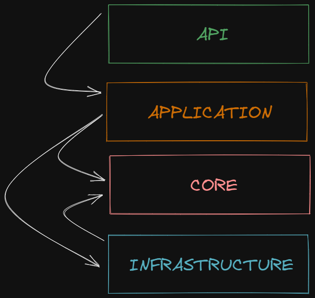
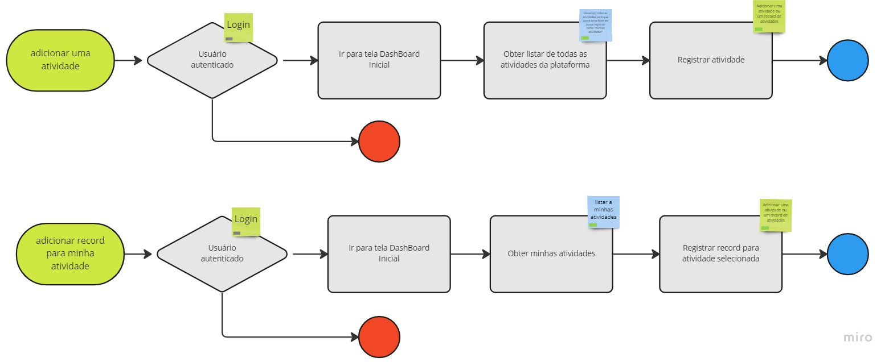
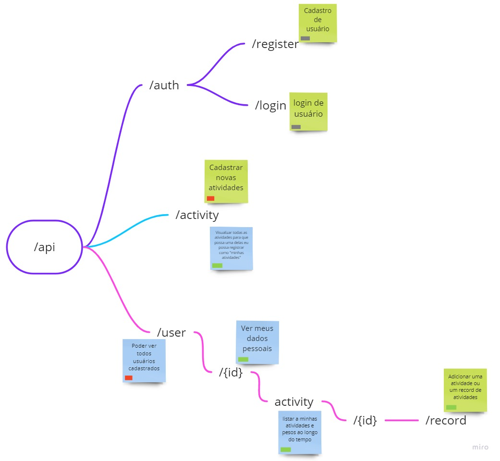
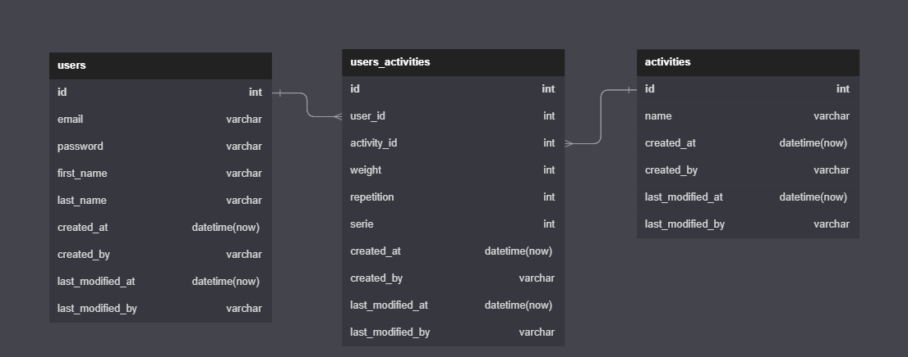

# TrainRecord 🏋️‍♀️

TrainRecord é uma aplicação desenvolvida em ASP.NET CORE C# com a finalidade de gerenciar atividades de academia para alunos e professores.

- [Tecnologias 💻](#tecnologias-💻)
  - [Pacotes](#pacotes)
  - [Prettier](#prettier)
  - [Husky](#husky)
- [Rodando a aplicação ⚙️](#rodando-a-aplicação-⚙️)
- [Arquitetura 🏛️](#arquitetura-🏛️)
  - [Pastas](#pastas)
- [Documentação API 💼](#documentação-api-💼)
  - [Diagramas](#diagramas)
  - [Listagem de Rotas](#listagem-de-rotas)
  - [Criar conta](#criar-conta)
  - [Login conta](#login-conta)
  - [Listar todas os usuários](#listar-todas-os-usuários)
  - [Adicionar record de atividade](#adicionar-record-de-atividade)
  - [Listar todas as atividades do aluno](#listar-todas-as-atividades-do-aluno)
  - [Listar todos os records de uma atividade do aluno](#listar-todos-os-records-de-uma-atividade-do-aluno)
  - [Adicionar uma nova atividade](#adicionar-uma-nova-atividade)
  - [Listar todas as atividade](#listar-todas-as-atividade)
- [Release 📦](#release-📦)
- [Autores 🧑‍🤝‍🧑](#autores-🧑‍🤝‍🧑)
- [License 🪪](#license-🪪)

# Tecnologias 💻

- AspNet.Core SDK 7.0.100-rc.2.22477.23

## Pacotes

- Mediatr: para gerenciar comandos e queries no padrão CQRS.
- FluentValidation: para validação dos campos de request.
- Mapster: para mapeamento dos objetos com Adapt<>().
- ErrorOr: para retorno de api com erro ou o response.
- Jwt: para autenticação do usuário.
- PasswordHasher: hasher de senha do usuário.
- Sqlite: apenas como banco de dados de desenvolvimento.

## Prettier

Como formatador de C# está sendo utilizado o [csharpier](https://csharpier.com) e suas configurações estão no arquivo .csharpierrc.json localizado na raiz deste projeto.

## Husky

As mensagens de commits deste repo seguem o seguinte regex
`^(feat|fix|ci|chore|docs|test|style|refactor|perf|build|revert)(\(.+?\))?: .{1,}$`.

No pré-commit executamos o comando `dotnet csharpier .` para formatar antes do commit.

# Rodando a aplicação ⚙️

Simplismente em seu terminal.

```sh
 git clone https://github.com/GustavoM96/TrainRecord.git
 dotnet build
 dotnet run --project src/TrainRecord.Api
```

# Arquitetura 🏛️

## Pastas

### Docs

- release: contém dados de cada release.
- todo: contendo os requesitos de desenvolvimento.

### Src



- Api - Camada de configuração de api, direcionar os dados de request e response para o usuário.

- Application - Camada responsável por criar os comandos e queries que conecta a api com a Infrastructure no padrão CQRS.

- Core - Camada de entidades, enums, exceptions e regras de negócio.

- Infrastructure - Camada que obtem dados externos como api, banco de dados, filas e outros.

### Assets

- contém imagens utilizadas.

# Documentação API 💼

## Diagramas

- Fluxos do usuário

    

- Mapeamento das rotas

    

- Entidades de Banco de dados

    

<hr/>

## Listagem de Rotas

Autenticação:

- Criar conta
- Login

Usuário:

- Listar todos os usuários

Atividade:

- Adicionar record de atividade
- Listar todas as atividades do aluno
- Listar todos os records de uma atividade do aluno
- Adicionar uma nova atividade
- Listar todas as atividade

## Criar conta

- Autenticação: Anônimo.
- Detalhes: registrar usuário dentro da plataforma.

### Request

```
Post /api/auth/register
```

```json
{
  "email": "josé.silva@gmail.com",
  "password": "sd#fd$904&3jkdf",
  "firstName": "José",
  "lastName": "Silva"
}
```

### Response 201 Created

```json
{
  "id": "00000000-0000-0000-0000-000000000000",
  "email": "josé.silva@gmail.com",
  "firstName": "José",
  "lastName": "Silva"
}
```

## Login conta

- Autenticação: Anônimo.
- Detalhes: autenticação do usuário.

### Request

```
Post /api/auth/login
```

```json
{
  "email": "josé.silva@gmail.com",
  "password": "sd#fd$904&3jkdf"
}
```

### Response 200 Ok

```json
{ "idToken": "fs432jnj543hb-lsdsdasdsadasd-df4545" }
```

## Listar todas os Usuários

- Autenticação: Apenas Adm.
- Detalhes: Obter todos os usuários cadastrados na plataforma.

```
Get /api/user
```

### Request

```json
sem corpo de requisição
```

### Response 200 Ok

```json
{
  "items": [
    {
      "id": "00000000-0000-0000-0000-000000000000",
      "email": "josé.silva@gmail.com",
      "firstName": "José",
      "lastName": "Silva"
    },
    {
      "id": "00000000-0000-0000-0000-000000000001",
      "email": "caio.costa@gmail.com",
      "firstName": "Caio",
      "lastName": "Costa"
    }
  ],
  "perPage": 2,
  "pageNumber": 4
}
```

## Adicionar record de atividade

- Autenticação: Apenas o dono do recurso.
- Detalhes: Adicionar registro de alteração de atividade do aluno.

```
Post /api/user/{userID}/activity/{id}/record
```

### Request

```json
{
  "weight": 20,
  "repetition": 4,
  "serie": 2
}
```

### Response 201 Created

```json
{
  "userId": "00000000-0000-0000-0000-000000000000",
  "activityId": "00000000-0000-0000-0000-000000000000",
  "weight": 20,
  "repetition": 4,
  "serie": 2
}
```

## Listar todas as atividades do aluno

- Autenticação: Apenas o dono do recurso.
- Detalhes: Listar todas as atividades que o aluno participa.

```
Get /api/user/{userId}/activity
```

### Request

```json
sem corpo de requisição
```

### Response 200 Ok

```json
{
  "items": [
    {
      "name": "pular corda",
      "id": "00000000-0000-0000-0000-000000000000"
    },
    {
      "name": "flexão de braço",
      "id": "00000000-0000-0000-0000-000000000000"
    }
  ],
  "perPage": 2,
  "pageNumber": 4
}
```

## Listar todos os records de uma atividade do aluno

- Autenticação: Apenas o dono do recurso.
- Detalhes: Listar todas os records de um aluno em uma atividade.

```
Get /api/user/{userId}/activity/{activityId}/record
```

### Request

```json
sem corpo de requisição
```

### Response 200 Ok

```json
{
  "items": [
    {
      "userId": "00000000-0000-0000-0000-000000000000",
      "activityId": "00000000-0000-0000-0000-000000000000",
      "weight": 0,
      "repetition": 30,
      "serie": 2,
      "id": "00000000-0000-0000-0000-000000000000"
    },
    {
      "userId": "00000000-0000-0000-0000-000000000000",
      "activityId": "00000000-0000-0000-0000-000000000000",
      "weight": 0,
      "repetition": 100,
      "serie": 5,
      "id": "00000000-0000-0000-0000-000000000000"
    }
  ],
  "perPage": 2,
  "pageNumber": 4
}
```

## Adicionar uma nova atividade

- Autenticação: Apenas Adm.
- Detalhes: Adicionar uma nova atividade dentro da plataforma.

```
Post /api/activity
```

### Request

```json
{
  "name": "flexão de braço"
}
```

### Response 201 Created

```json
{
  "id": "00000000-0000-0000-0000-000000000000",
  "name": "flexão de braço"
}
```

## Listar todas as atividade

- Autenticação: usuários autenticados,
- Detalhes: Listar todas as atividade

```
Get /api/activity
```

### Request

```json
sem corpo de requisição
```

### Response 200 Ok

```json
{
  "items": [
    {
      "id": "00000000-0000-0000-0000-000000000000",
      "name": "flexão de braço"
    },
    {
      "id": "00000000-0000-0000-0000-000000000001",
      "name": "pular corda"
    }
  ],
  "perPage": 2,
  "pageNumber": 4
}
```

# Release 📦

- 0.1.0
  - Public release

# Autores 🧑‍🤝‍🧑

- Gustavo Henrique Messias [GitHub](https://github.com/GustavoM96) | [Porttfolio](https://gustavo-messias.vercel.app)

# License 🪪

This project is licensed under the terms of the [MIT](https://github.com/GustavoM96/TrainRecord/blob/main/LICENSE) license.
